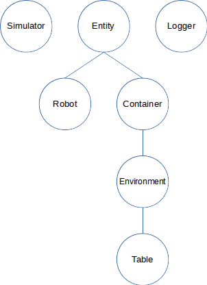

# Toy Robot Simulator

## Description from Client Brief

* The application is a simulation of a toy robot moving on a square tabletop, of dimensions 5 units x 5 units.
* There are no other obstructions on the table surface.
* The robot is free to roam around the surface of the table, but must be prevented from falling to
destruction. Any movement that would result in the robot falling from the table must be prevented,
however further valid movement commands must still be allowed.
* Create an application that can read in commands of the following form:
```
PLACE X,Y,F
MOVE
LEFT
RIGHT
REPORT
```

### Semantics of Commands

#### Input

Input can be from a file, or from standard input, as the developer chooses.


#### Place Command

`PLACE` will put the toy robot on the table in position X,Y and
facing NORTH, SOUTH, EAST or WEST.

#### Report Command

`REPORT` will announce the X,Y and F of the robot. This can be in any form, but
standard output is sufficient.

#### Move Command

`MOVE` will move the toy robot one unit forward in the direction it is currently
facing.

#### Left Command

`LEFT` will rotate the robot 90 degrees counter-clockwise (i.e. North turns to West).

#### Right Command

`RIGHT` will rotate the robot 90 degrees clockwise (i.e. North turns to East).


#### Constraints

##### Turning Commands

Turning commands do not change the position of the robot.

##### Origin

The origin (0,0) can be considered to be the SOUTH WEST most corner.

##### Valid Commands

The first valid command to the robot is a `PLACE` command, after that, any
sequence of commands may be issued, in any order, including another `PLACE`
command. The application should discard all commands in the sequence until a
valid `PLACE` command has been executed.

The toy robot must not fall off the table during movement. This also includes
the initial placement of the toy robot.  Any move that would cause the robot
to fall must be ignored.

A robot that is not on the table can choose the ignore the `MOVE`, `LEFT`, `RIGHT`,
and `REPORT` commands.


#### Examples

##### Example A

###### Input
```
PLACE 0,0,NORTH
MOVE
REPORT
```
###### Output
```
0,1,NORTH
```


##### Example B

###### Input
```
PLACE 0,0,NORTH
LEFT
REPORT
```
###### Output
```
0,0,WEST
```


##### Example C

###### Input
```
PLACE 1,2,EAST
MOVE
MOVE
LEFT
MOVE
REPORT
```
###### Output
```
3,3,NORTH
```


### Testing

Provide test data to exercise the application.


## Analysis and Design Decisions

### Classes

* Simulator
* Entity / Robot
* Entity / Container / Environment / Table
* Logger
* Parser



#### Simulator

A Simulator manages a simulation, which may involve Entities.

Verbs:

* Load simulation
* Simulate

#### Entity

An Entity is an object that is managed in a simulation.  Entities are contained in Containers.

Verbs:

* What is my container?
* What is my location?

##### Robot

A Robot is an Entity that moves on a Table.

Verbs:

* Move
* Turn (Left/Right)
* Face (Place)

##### Container

A Container is an Entity that can contain other Entities.

Attributes:

* Contents

Verbs:

* Add
* Remove
* Do I contain entity x?

##### Environment

An Environment is a container that provides locations for contained Entities to be placed.

Verbs:

* Place

##### Table

A Table is an Environment where a Robot can be placed and move around.

Attributes:

* Size

Since constants are often changed, the size of the table may be.
Only the class library allows this.  The simulation still runs with a table of size 5 (as according to the brief).

Verbs:

* Does the table exist at this location?

##### Parser

A Parser reads from a file or pipe and parses the stream into messages (i.e. method calls to a target object).

Verbs:

* Start parsing
* Stop parsing

### Languages/Protocols

#### Robot Command Language

The robot command language has the following syntax:


Each command line corresponds to the respective commands above.

### Testing

There is a separate folder for testing.
The folder contains MiniTest scripts for each class.
