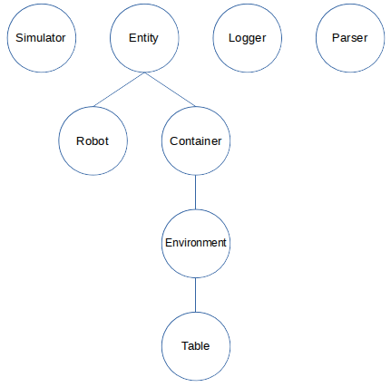

# Toy Robot Simulator

## Description from Client Brief

* The application is a simulation of a toy robot moving on a square tabletop, of dimensions 5 units x 5 units.
* There are no other obstructions on the table surface.
* The robot is free to roam around the surface of the table, but must be prevented from falling to
destruction. Any movement that would result in the robot falling from the table must be prevented,
however further valid movement commands must still be allowed.
* Create an application that can read in commands of the following form:
```
PLACE X,Y,F
MOVE
LEFT
RIGHT
REPORT
```


## Analysis and Design Decisions

### Classes

* Simulator
* Entity / Robot
* Entity / Container / Environment / Table
* Logger
* Parser



#### Simulator

A Simulator manages a simulation, which may involve Entities.

Verbs:

* Load simulation
* Simulate

#### Entity

An Entity is an object that is managed in a simulation.  Entities are contained in Containers.

Verbs:

* What is my container?

##### Robot

A Robot is an Entity that moves on a Table.

Verbs:

* Move

##### Container

A Container is an Entity that can contain other Entities.

Verbs:

* Add
* Remove

##### Environment

An Environment is a container that provides locations for contained Entities to be placed.

Verbs:

* Place

##### Table

A Table is an Environment where a Robot can be placed and move around.

Verbs:

* Does the table exist at this location?

##### Parser

A Parser reads from a file or pipe and parses the stream into messages (i.e. method calls to a target object).

Verbs:

* Start parsing


