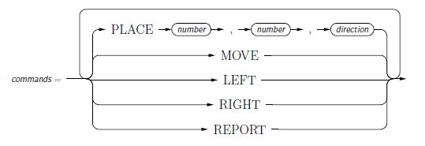

# Toy Robot Simulator
_Software Engineering Presentation_

> This is a software engineering project presenting various software engineering processes and concepts
that would be applied to a large project, even those the project is small.  
>  
The approach is a simulated agile approach.  This is done by simulating a trickle of new requirements by
segmenting the brief.  A test/behaviour driven development approach is taken.  The project is broken up
so that multiple developers can work simultaneously.  
>  
Although the techniques applied here may be excessive for a small project, small projects can easily become
large projects.  The techniques of Object Oriented Design and Parsing are applied to allow for significant
expansion.

## Introduction

This project consists of an application and library.  The project simulates the control of a simple robot on a simple desktop.
The application allows users to use software; while the library allows developers to use the software in another project.

## Download

This project assumes that you have [Ruby](https://www.ruby-lang.org/en/) (>=1.9) installed.

You can download the project using Git, or you can download a Zip file directly from the GitHub page.
Using Git has the advantage that you can keep up with further development of the project, and perhaps
even contribute to the project.

### Using Git

To download using Git, you will need to have Git installed.
If you do not have Git, go to the [Git download page](http://git-scm.com/downloads).

Then download using the Git clone command.
```Bash
git clone https://github.com/luisestebanconsulting/toy_robot_simulator.git
```

### Using Zip

1. Download the Zip file from GitHub (https://github.com/luisestebanconsulting/toy_robot_simulator).
2. Unzip into a desired directory.


## Requirements and Dependencies

This project assumes that you have [Ruby](https://www.ruby-lang.org/en/) (>=1.9) installed.

## Installation

The Toy Robot Simulator project does not require any system installation to run.

If you are planning to use the library for other projects, you can manually install
the library into your project.  In the future, this project will be available as a gem.

## Usage

Currently, only the infrastructure exists, so only the empty program can be launched, which does nothing.


### Shell Command Usage

Use the shell of the operating system to change directory to the top level of the project directory.
Alternatively, you can modify the `PATH` to include the project directory.

If the operating system supports executable files (specifically executable Ruby scripts), then you can launch
a robot using the command `robot.rb`; otherwise, you will need to launch it with Ruby, `ruby robot.rb`.
Many default operating system setups do not include the current directory for executable files

#### Synopsis

```
robot_simulator 
robot_simulator -h
robot_simulator cmdfile
cat cmdfile | robot_simulator
```

The first usage, without arguments, is an interactive mode where the user types commands interactively with the simulator; unless
input comes from the output of another process.
The `-h` flag requests command line usage.
When a file argument is used, simulator commands are read from the file.  Only in the interactive mode is the `QUIT` command available
which terminates the program; otherwise, the program terminates at the end of the file.


#### Linux

```Bash
$ cd bin
$ robot_simulator [-h] [cmdfile]
```

#### Mac OS X

```Bash
$ cd bin
$ robot_simulator [-h] [cmdfile]
```
#### Windows

```DOS
C:> cd bin
C:> robot_simulator.bat [-h] [cmdfile]
```

### Robot Command Language

Commands are issued to the simulator according to the following railroad diagram.



Note, the `QUIT` command is available in interactive mode only.


## Testing

All the testing files can be run by

```
$ cd test
$ ruby test_robot_simulator.rb
```

Individual modules can be tested by running the corresponding test file, e.g.:

```
$ cd test
$ ruby test_robot.rb
```

A number of systematically generated test programs (i.e. robot command files) are located in
`Application/test/programs`.  These programs are contained in and generated by
`Application/test/programs/gen_test_progs.rb`.  This file can be modified to incorporate exhaustive testing.


## History

Most recent work was:

* Systematic testing of the simulation (in particular testing for the robot falling off the table and moving correctly)
* Correct bugs with placing and facing of the robot


```
* de2c242 2015-04-20 | Completed remaining empty classes (see Documentation/Requirements.md): Completed definitions of Entity classes (Entity, Container, Envi
ronment), of Robot and Table, and of the Simulator. (HEAD, origin/master, origin/HEAD, master) [Luis Esteban]
* 8af7281 2015-04-20 | Basic Logging and Basic Parsing (see Documentation/Requirements.md): Created Parser class, filled in basic functions of Logger class. (
HEAD, origin/master, origin/HEAD, master) [Luis Esteban]
* a671371 2015-04-16 | Empty infrastructure (Simulator, Entity/Robot. Entity/Container/Environment/Table, Logger) from initial client brief (see Documentation
/Requirements.md) (tag: v0.0) [Luis Esteban]
* 70acc71 2015-04-16 | Initial commit [Luis Esteban]
```

## Contributing

> The purpose of this project, being a presentation, precludes contributions. 

## Author

Luis Esteban M.Sc., M.Teach.


## License

(No License)

Copyright (c)2015

Due to the nature of this project, duplication is not permitted.  However, transfering this project to another computer is permitted for analysis purposes.
Modification is not permitted except for the purpose of providing feedback to author.


THE SOFTWARE IS PROVIDED 'AS IS', WITHOUT WARRANTY OF ANY KIND,
EXPRESS OR IMPLIED, INCLUDING BUT NOT LIMITED TO THE WARRANTIES OF
MERCHANTABILITY, FITNESS FOR A PARTICULAR PURPOSE AND NONINFRINGEMENT.
IN NO EVENT SHALL THE AUTHORS OR COPYRIGHT HOLDERS BE LIABLE FOR ANY
CLAIM, DAMAGES OR OTHER LIABILITY, WHETHER IN AN ACTION OF CONTRACT,
TORT OR OTHERWISE, ARISING FROM, OUT OF OR IN CONNECTION WITH THE
SOFTWARE OR THE USE OR OTHER DEALINGS IN THE SOFTWARE.
